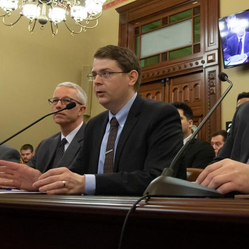

<figure class="headshot">
  
  <figcaption>
    Image credit: BRIAN MACKEY /
    <a href="https://www.nprillinois.org/post/lawmakers-consider-new-measures-ethics-violations-government#stream/0">NPR Illinois</a>
    (2020)
  </figcaption>
</figure>

I am a joint PhD candidate in [Political Science](https://lsa.umich.edu/polisci) and [Public Policy](https://fordschool.umich.edu) and a [Rackham Merit Fellow](https://rackham.umich.edu/funding/rackham-merit-fellowship-program/) at the University of Michigan. My research interests center on interest groups, political access, and how democratic institutions respond to organized interests. Although currently on fellowship, I most recently served as a graduate student instructor for PolSci 432: Law and Public Policy. I have also occasionally worked as an independent consultant.  

In 2022, I earned my Master of Public Policy from the [Gerald R. Ford School of Public Policy](http://fordschool.umich.edu/) with a [concentration in analysis methods](https://fordschool.umich.edu/mpp-mpa/mpp/concentrations). During my time at Michigan, I served as Editor in Chief of the [Michigan Journal of Public Affairs](http://mjpa.umich.edu/) and as a Graduate Student Instructor for [PubPol 201: Systematic Thinking](pdfs/PP 201 - Systematic Thinking syllabus.pdf). I also worked as a Policy Analyst for the Fiscal Health Project at the [Center for Local, State, and Urban Policy](http://closup.umich.edu/), interned with [CARE](https://www.care.org/), and participated in a project through the [Program in Practical Policy Engagement](http://practicalpolicy.umich.edu/) for the City of Detroit. I additionally served as Visiting Editor for the 32nd edition (2021) of the [Princeton Journal of Public and International Affairs](https://jpia.princeton.edu/).  

Before returning to academic life, I served as a Policy Specialist with the [National Conference of State Legislatures](http://www.ncsl.org), Center for Ethics in Government and Center for Legislative Strengthening. My research encompassed legislative institutions across all U.S. states and territories. In ethics, I covered conflicts of interest, financial disclosures, lobbyist regulation, and ethics oversight. My work on legislative institutions addressed a wide range of topics, including separation of powers, legislative procedure, legislative HR policies, and First Amendment issues. I provided non-partisan trainings, testimony, and technical assistance at the request of NCSL constituents—state legislators and legislative staff.  

My work often crossed disciplinary lines, driven by the needs of public officials, state employees, industry contacts, academics, journalists, and the public. I regularly coordinated with NCSL’s Elections and Redistricting team and addressed questions related to sexual harassment and civility. Many of these projects required engaging legal issues at the intersection of ethics, privacy, speech, and due process; my publications also incorporated research in moral philosophy and psychology. I administered Westlaw account access and managed Continuing Legal Education (CLE) course compliance and accreditation for NCSL’s annual conference, which hosted thousands of state government professionals.  

Prior to NCSL, I served as Faculty Services Senior Researcher at the [University of Kansas School of Law](https://law.ku.edu), where I taught courses on legal research and appellate advocacy while providing research assistance to faculty and university administration. My work spanned environmental law, international law, academic admissions policy, transactional law, business organizations, campus assault, diverse student success initiatives, legal pedagogy, criminal law, and more.  

I hold a Master of Public Policy (University of Michigan, 2022), a Juris Doctor with an advocacy certificate (University of Kansas, 2015), and a B.A. in Political Science ([Washburn University](https://www.washburn.edu/index.html), 2012). 

Thank you for visiting my website.